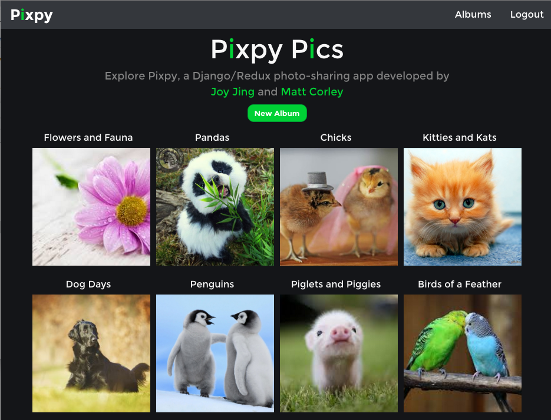
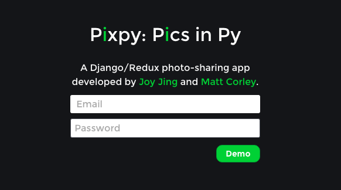

# Pixpy

[Pixpy live][live]

[live]: http://www.pixpy.tech/

Pixpy is a full-stack photo-sharing web application. It utilizes Django + Django REST Framework for the backend Web API, a PostgreSQL database, and React.js with a Redux architecture on the frontend.

The project began with a [boilerplate project][boilerplate]  We build on the shoulders of giants with the following technologies:

[boilerplate]: https://github.com/Seedstars/django-react-redux-jwt-base

**Frontend**

* [React](https://github.com/facebook/react)
* [React Router](https://github.com/rackt/react-router)
* [JSON Web Token](https://www.npmjs.com/package/jsonwebtoken) JSON Web Token for API authentication
* [Babel](http://babeljs.io) for ES6 and ES7 magic
* [Webpack](http://webpack.github.io) for bundling
* [Webpack Dev Middleware](http://webpack.github.io/docs/webpack-dev-middleware.html)
* [Redux](https://github.com/rackt/redux)'s [Flux](https://facebook.github.io/react/blog/2014/05/06/flux.html) implementation
* [Redux Dev Tools](https://github.com/rackt/redux-devtools) for next generation DX (developer experience). Watch [Dan Abramov's talk](https://www.youtube.com/watch?v=xsSnOQynTHs)
* [Redux Thunk](https://github.com/gaearon/redux-thunk) Thunk middleware for Redux - used in async actions
* [React Router Redux](https://github.com/rackt/react-router-redux) Ruthlessly simple bindings to keep react-router and redux in sync
* [fetch](https://github.com/github/fetch) A window.fetch JavaScript polyfill
* [style-loader](https://github.com/webpack/style-loader), [sass-loader](https://github.com/jtangelder/sass-loader) and [less-loader](https://github.com/webpack/less-loader) to allow import of stylesheets in plain css, sass and less,
* [font-awesome-webpack](https://github.com/gowravshekar/font-awesome-webpack) to customize FontAwesome, and
* [ESLint](http://eslint.org), [Airbnb Javascript/React Styleguide](https://github.com/airbnb/javascript), [Airbnb CSS / Sass Styleguide](https://github.com/airbnb/css) to maintain a consistent code style

**Backend**

* [Django](https://www.djangoproject.com/)
* [Django REST framework](http://www.django-rest-framework.org/) Django REST framework is a powerful and flexible toolkit for building Web APIs
* [Django REST framework JSON Web Token](http://getblimp.github.io/django-rest-framework-jwt/) JSON Web Token Authentication support for Django REST Framework
* [WhiteNoise](http://whitenoise.evans.io/en/latest/django.html) to serve files efficiently from Django

## Features & Implementation

### Single-Page App

Pixpy is a single-page app; all content is delivered on one static page. The UI is designed to be elegant and intuitive with a straightforward layout.

### Albums

Users can see and create photo `Album`s from the `AlbumView` page.

New albums show a default "empty album" cover photo. The first photo uploaded to an album is automatically set as the new album cover photo on the backend.

When a new album is created, the user is immediately directed to the `AlbumDetailView` where they can upload photos to the album. All albums belong to a user via `user_id`. Only the user who initially created an album can upload photos to that album.

### Photos

Users can see and add `Photo`s from the `AlbumDetailView`. Photos are hosted on Cloudinary, and hold a foreign key to the `album_id` they belong to. When a photo is uploaded, a modal pops up displaying the photo and asks for an optional `caption`. Focus is automatically placed on the caption input field, which can be submitted either using the Enter key or by clicking the return button.

From the `AlbumDetailView`, when a user clicks on a photo, it opens in a modal displaying both the image and caption. Clicking anywhere off of the modal closes the modal.

Users can browse and view all albums and photos, but can only add photos to their albums. This restriction is reinforced both on the frontend (the button is not displayed) as well as the backend (the photo will not be saved if the current user is not the creator of the album).

### User Authentication

Pixpy uses a JSON Web Token (JWT) authentication scheme.  JWTs are a compact, self-contained mechanism for securely transmitting information between parties as digitally signed JSON objects.

When a user successfully logs in using her credentials, a JSON Web Token will be returned and persisted to local storage.  This token is then passed in the `Authorization` header of all HTTP requests against protected resources.  

Because the token is "self-contained", we are able to write stateless APIs on the backend--after validating the JWT signature, user information is read from the token and protected resources are served appropriately.
